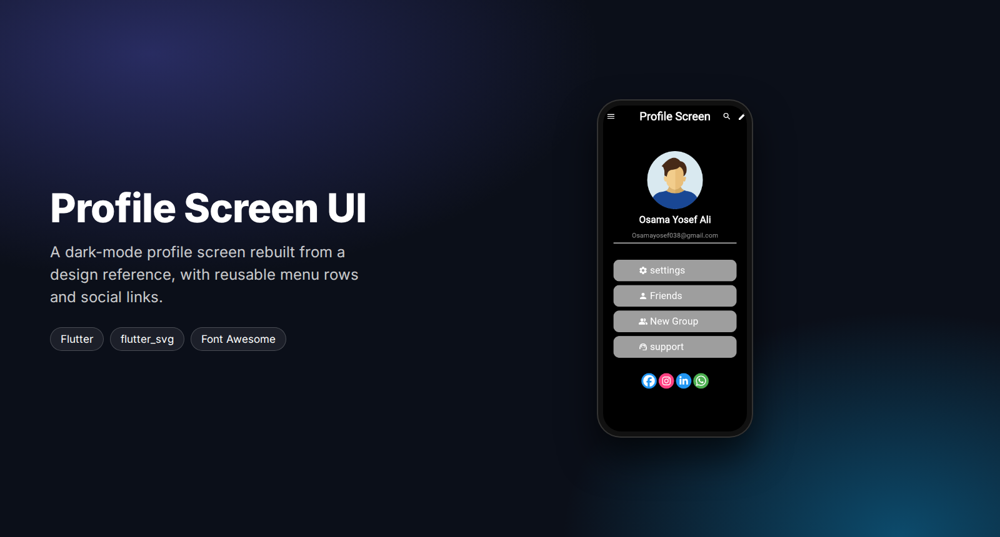
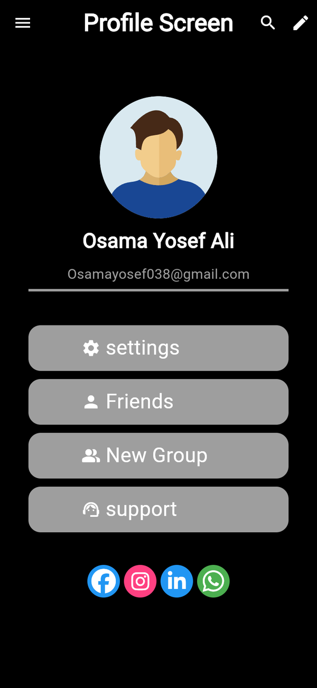

<div align="center">



<br/>

[](https://flutter.dev)
[](https://dart.dev)

**A dark-mode profile screen, built from a design reference.**
Avatar, name and email, a settings-style menu and social links, with the focus on spacing,
typography and reusable widgets.

</div>

---

## Screenshot

<p align="center">
  
</p>

## What's inside

- **Custom app bar** with menu, search and edit actions
- **Circular SVG avatar**, name and email, separated by a divider
- **Reusable menu row** (`Costam_wedget`) that takes an icon and a label: Settings, Friends, New Group, Support
- **Social links** row with Facebook, Instagram, LinkedIn and WhatsApp icons
- High-contrast dark layout

## Tech stack

| Area | Choice |
|:--|:--|
| Framework | Flutter, Dart |
| Graphics | `flutter_svg` |
| Icons | `font_awesome_flutter` |

```
lib/
├── screen/
│   └── home_screen.dart      the profile screen
├── wedget/
│   ├── My_app_bar.dart       custom app bar
│   ├── Costam_wedget.dart    reusable icon + label row
│   └── My_app.dart           app root
└── main.dart
```

## Getting started

```bash
flutter pub get
flutter run
```

## Author

**Osama Yosef** · Flutter developer, Cairo

[](https://github.com/osama-Yosef)
[](https://www.linkedin.com/in/osama-yosef-819268319)
[](https://upwork.com/freelancers/~014ebd205ef38ca04c)
[](mailto:osamayosef038@gmail.com)
